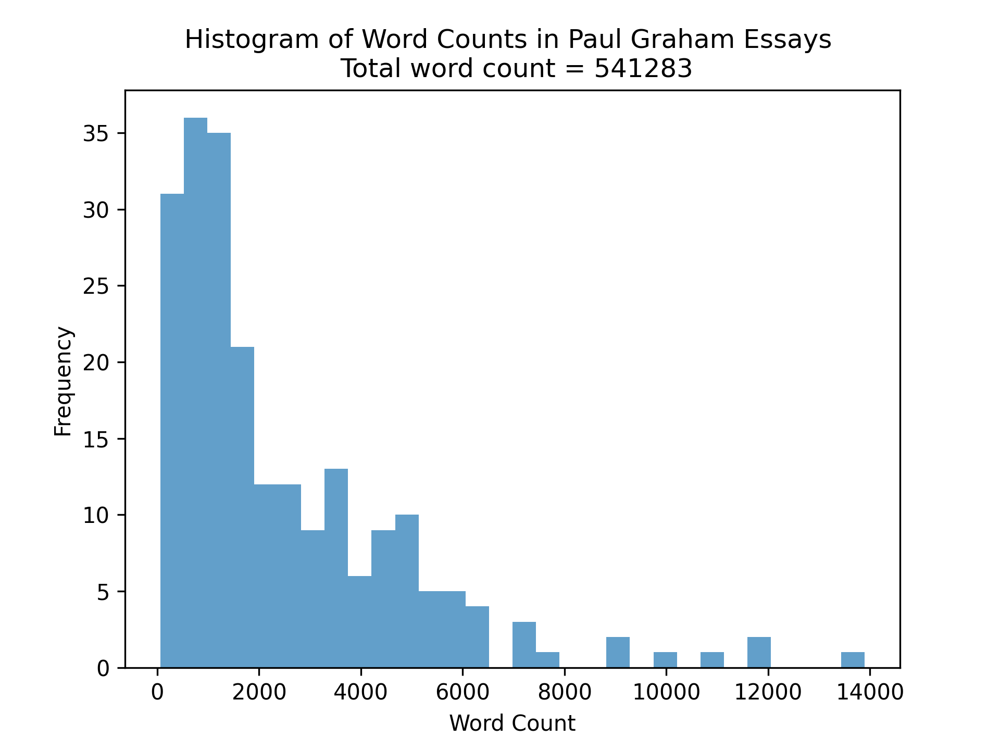

A simple program that visits every Paul Graham essay listed in the RSS feed 
made by Aaron Swartz (http://www.aaronsw.com/2002/feeds/pgessays.rss), gathers word counts and plots a histogram with the total word count. This process is run every day at midnight (Eastern time) to account for new essays that PG publishes. 

Can be adapted to gather all sorts of other essay-specific statistics or data.

# Install and Run
Built using Python 3.11.6. Install requirements with `pip install -r requirements.txt`. 
Run the word counter with `python scrape_essays.py`, which produces a CSV file with the word counts, `pg_essays_wc.csv`.
Sum the word counts and plot a histogram with `python visualize_wc.py`. 

# Results
The histogram of word counts is below. This is automatically updated every day at midnight (Eastern time) to account for new essays that PG publishes.

