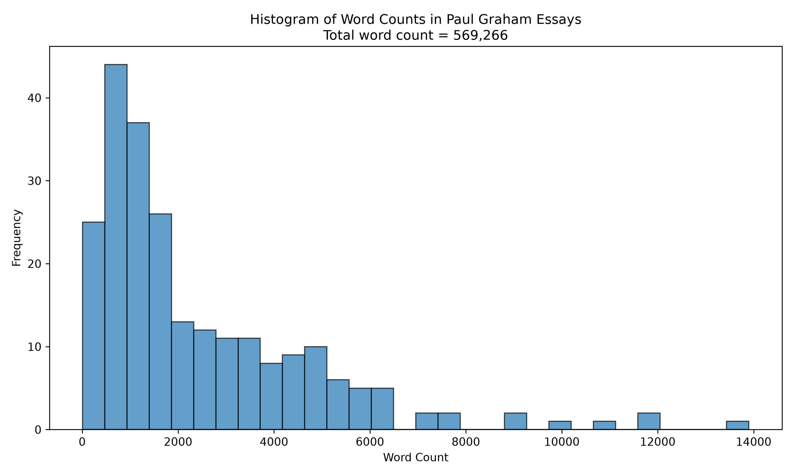

# Paul Graham Essays Scraper & Dashboard

A scraper that visits every Paul Graham essay listed on [paulgraham.com/articles.html](http://paulgraham.com/articles.html), gathers word counts and publication dates, and generates static visualizations, an interactive dashboard, topic analysis, and an Atom feed. Runs daily via GitHub Actions.

## Features

- **Web scraping** with retry logic (3 retries, exponential backoff) and URL deduplication
- **Publication dates** extracted from essay text with Wayback Machine fallback
- **Static visualizations**: histogram, scatter plot with trend line, cumulative word count chart
- **TF-IDF topic analysis**: top keywords per essay and corpus-wide themes
- **Interactive Plotly dashboard** with sortable essay table (`docs/index.html`)
- **Atom/RSS feed** of the 20 most recent essays (`docs/feed.xml`)
- **Test suite** with pytest

## Install and Run

Built using Python 3.11. Install requirements:

```bash
pip install -r requirements.txt
pip install -r requirements-dev.txt  # for testing
```

Run the pipeline:

```bash
python scrape_essays.py        # Scrape essays → pg_essays_wc.csv
python visualize_wc.py         # Generate static PNGs → docs/
python analyze_topics.py       # TF-IDF analysis → docs/topic_analysis.json
python generate_dashboard.py   # Interactive dashboard → docs/index.html
python generate_feed.py        # Atom feed → docs/feed.xml
```

Run tests:

```bash
pytest tests/ -v
```

## Output Files

| File | Description |
|------|-------------|
| `pg_essays_wc.csv` | Essay titles, links, word counts, publication dates |
| `publication_dates.json` | Cached publication dates (keyed by URL) |
| `essay_texts.json` | Cached essay texts for topic analysis (gitignored) |
| `docs/word_count_histogram.png` | Word count distribution |
| `docs/word_count_over_time.png` | Scatter plot with trend line |
| `docs/cumulative_word_count.png` | Cumulative word count over time |
| `docs/topic_analysis.json` | TF-IDF keywords and themes |
| `docs/index.html` | Interactive Plotly dashboard |
| `docs/feed.xml` | Atom feed of recent essays |

## GitHub Pages

The `docs/` directory is deployed to GitHub Pages. Configure your repository to serve Pages from the `docs/` folder on the `main` branch.

- **Dashboard**: `https://<username>.github.io/<repo>/`
- **Feed**: `https://<username>.github.io/<repo>/feed.xml`
